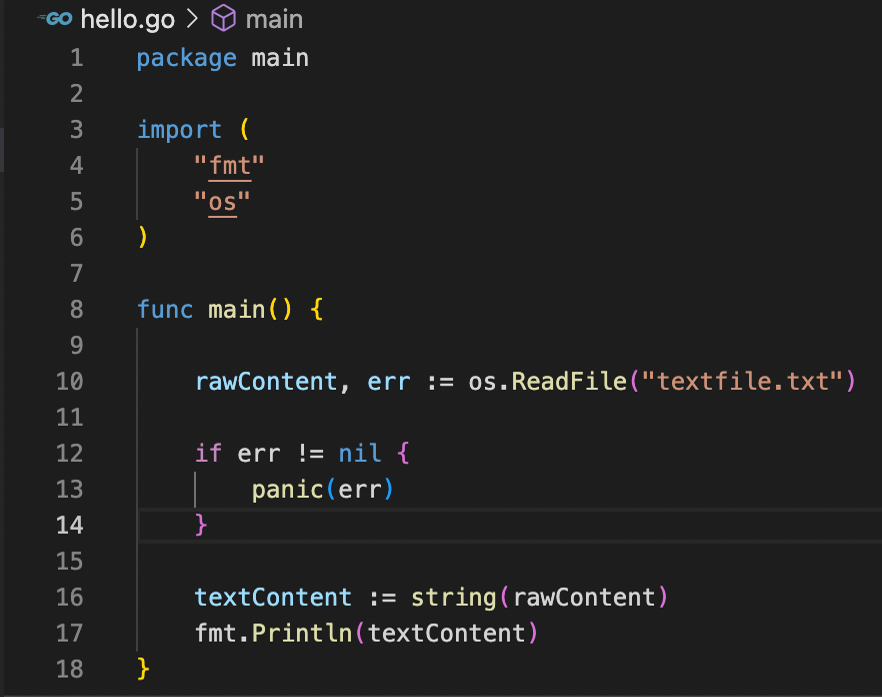
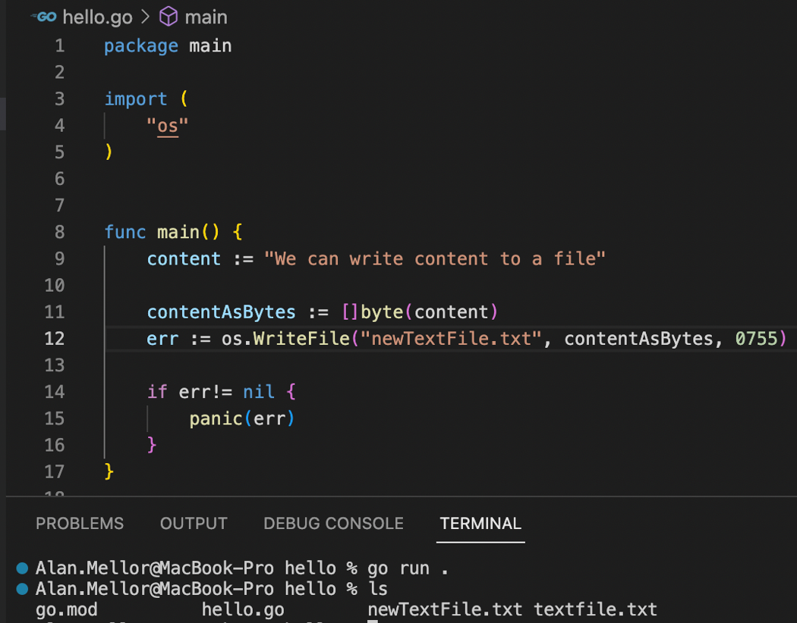

# Time Entry

A customer has come to us with a problem:

"We record working hours in the format ```HH:mm-HH:mm``` which is 24H format, for example ```19:00-05:00```."

"These are in a file which has one entry per line, as in the attached times.csv file."

"From 6:30 am to 10:30 pm we have regular working hours, and from 10:30 pm to 6:30 am the next day we have night hours."

"We need to know how many night hours and how many regular working hours are worked when given an input file."

"Please note, the minimum increment that can be recorded is 30m, the maximimum is 12 hours, and shifts start or end on the hour or every half hour."

## Task

> Create a program that reads the input file and returns the total regular working hours and the total night hours.

> Your solution should include unit tests.

# Reading From Files in Go

We can work with text files in Go ​

CRUD​:

- **C**reate a file​
- **R**ead a file​
- **U**pdate (change) a file​
- **D**elete a file​

Files store information when we switch the computer off​

## Reading a file

We need to import a new package "os" into our program to work with the Operating System (the OS).

When we have this we can use `os.ReadFile("path/filename")` to get the content of that file as `[]byte`.



Note here that this assumes you have a file named `textfile.txt` in the same folder as `main.go` with some actual text in it!

## Writing a file

Writing a file is very similar to reading a file using the `os` import.

The function to call is `os.WriteFile()`
- First parameter – filename/extension
- Second – content to write as []byte
- Third – Unix permissions (don't worry about these too much right now!)

here's an example of writing a file locally to a file called `newTextFile.txt`:



We have `content` which is a string, we then pass it to a slice of `byte` and assign that result to `contentAsBytes`.

This allows us to use `os.WriteFile`.

### What the hell are bytes and why are we using them?
ChatGPT says:
> Files are typically sequences of bytes. When you write data to a file, you need to represent that data as a sequence of bytes. Strings are a higher-level abstraction, and their internal representation may involve various encoding schemes (e.g., UTF-8). Converting a string to bytes ensures that the data is in a format suitable for writing to a file.

More information on bits and bytes here:

https://www.bbc.co.uk/bitesize/guides/z6qqmsg/revision/1 